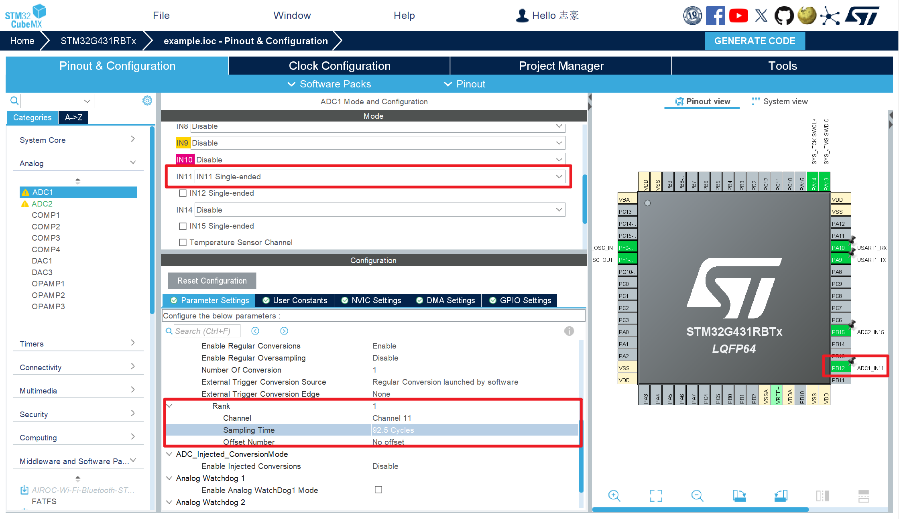
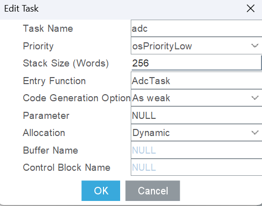
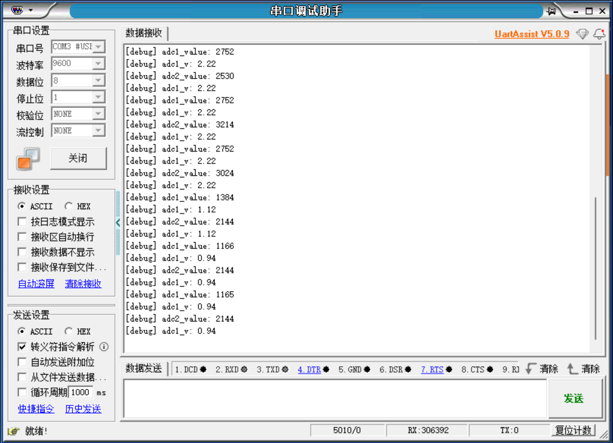

# ADC单次转换

## Cubx配置
本次实验使用adc单端转换

一般来说只需要配置ADC通道的的采样周期即可，新开一个线程完成ADC采样和应用处理





## 示例应用代码

采集可调节电阻电压，通过串口打印adc**采样值**和**采样电压**

```c
#include "app.h"

double adc1_v = 0;
double adc2_v = 0;

void AdcTask(void *arg){
    uint32_t adc1_value = 0;
    uint32_t adc2_value = 0;


    HAL_ADCEx_Calibration_Start(&hadc1,ADC_SINGLE_ENDED);
    HAL_ADCEx_Calibration_Start(&hadc2,ADC_SINGLE_ENDED);
    while (1){
        HAL_ADC_Start(&hadc1);
        adc1_value = HAL_ADC_GetValue(&hadc1);

        HAL_ADC_Start(&hadc2);
        adc2_value = HAL_ADC_GetValue(&hadc2);

        adc1_v = 3.3 * (adc1_value / 4096.0);
        adc2_v = 3.3 * (adc2_value / 4096.0);

        debug("adc1_value: %ld",adc1_value);
        debug("adc1_v: %.2lf",adc1_v);
        debug("adc2_value: %ld",adc2_value);
        debug("adc1_v: %.2lf",adc1_v);
        
        osDelay(1000);
    }
}
```

:::warning
值得注意的是，当我们打印浮点数的时候可能是不会显示的，需要在`CMakeLists.txt`中添加一个编译参数

```cmake
set(CMAKE_C_FLAGS "${CMAKE_C_FLAGS} -u_printf_float")
```
:::

### 示例结果



