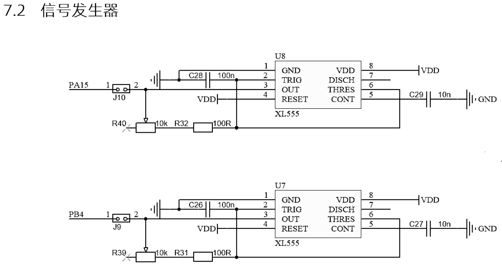
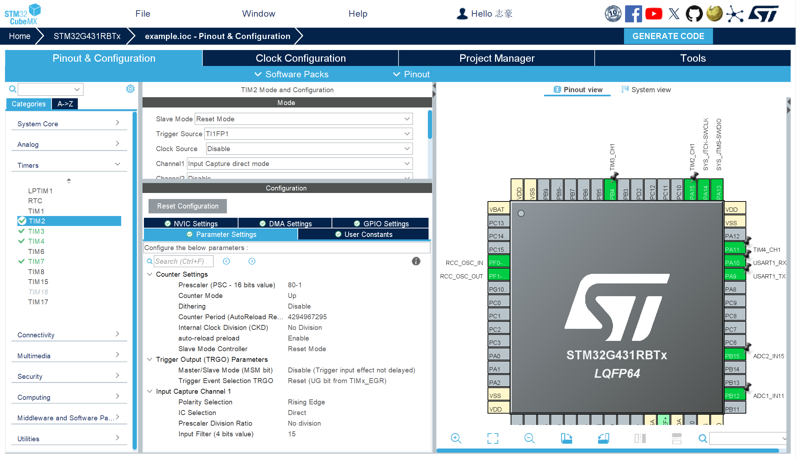

# 输入捕获

使用通用定时器输入捕获功能测量PWM信号的频率

使用板载的`XL550`产生PWM信号，电路图如下：



## 驱动思路

使用定时器主从模式和输入捕获模式，当信号输入发送上边沿跳变时，触发CCR锁存CNT值，触发reset清空CNT，这样我们只需要在特定时间读取CCR的值，通过 $f_{x} = N/T$ 计算出频率。[^1]

[^1]: [STM32入门教程-2023版 TIM输入捕获](https://www.bilibili.com/video/BV1th411z7sn?p=17&vd_source=5eb3559f14ff1452cac51806869d20fd)

## 应用实例

### 初始化外设(cubx)

:::tip
以TIM2CH1为例
:::



### 处理线程

```c title="freq.c"
#include "app.h"

typedef struct
{
  HAL_TIM_StateTypeDef state;
  uint32_t ccr;
  uint32_t freq;
}freqData_t;

freqData_t tim2Ch1;
freqData_t tim3Ch1;

uint32_t ch1_cnt = 0;
uint32_t ch1_freq = 0;

void FreqTask(void *arg) {
  HAL_TIM_Base_Start(&htim2);
  HAL_TIM_IC_Start(&htim2, TIM_CHANNEL_1);

  HAL_TIM_Base_Start(&htim3);
  HAL_TIM_IC_Start(&htim3, TIM_CHANNEL_1);
  while (1) {
    tim2Ch1.ccr = HAL_TIM_ReadCapturedValue(&htim2, TIM_CHANNEL_1);
    tim2Ch1.freq = 1000000 / tim2Ch1.ccr;
    tim2Ch1.state = HAL_TIM_IC_GetState(&htim2);

    tim3Ch1.ccr = HAL_TIM_ReadCapturedValue(&htim3, TIM_CHANNEL_1);
    tim3Ch1.freq = 1000000 / tim3Ch1.ccr;
    tim3Ch1.state = HAL_TIM_IC_GetState(&htim3);

    /* app start */
    debug("tim2Cn1_state ret:%d",tim2Ch1.state);
    debug("tim2Cn1_freq:%d hz", tim2Ch1.freq);

    debug("tim3Cn1_state ret:%d",tim3Ch1.state);
    debug("tim3Cn1_freq:%d hz", tim3Ch1.freq);
    /* app end */
    osDelay(500);
  }
}
```

## 测试结果

```log
[debug] tim2Cn1_state ret:2
[debug] tim2Cn1_freq:788 hz
[debug] tim3Cn1_state ret:2
[debug] tim3Cn1_freq:2754 hz
[debug] tim2Cn1_state ret:2
[debug] tim2Cn1_freq:740 hz
[debug] tim3Cn1_state ret:2
[debug] tim3Cn1_freq:2754 hz
[debug] tim2Cn1_state ret:2
[debug] tim2Cn1_freq:705 hz
[debug] tim3Cn1_state ret:2
[debug] tim3Cn1_freq:2898 hz
[debug] tim2Cn1_state ret:2
[debug] tim2Cn1_freq:867 hz
[debug] tim3Cn1_state ret:2
[debug] tim3Cn1_freq:3067 hz
```

## 参考文献


