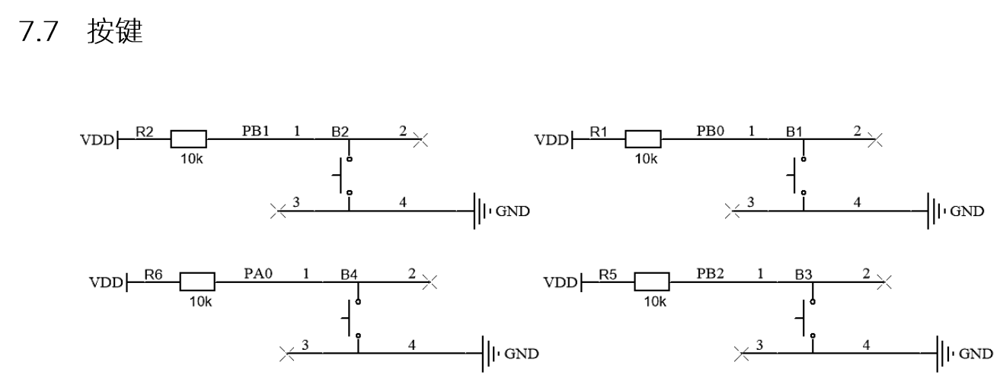

# 按键驱动

## 硬件描述



## 驱动思路

使用一个**高优先级**的任务扫描按键，在200ms中记录某个按键被按下的次数，再通过软件定时器的回调函数，编写对应按键的按下次数的应用代码。

```c
// 待补充 源码 key.c
```

值得注意的是，这里只包含单击和双击的解决方案，当任务中需要实现长按按键的时候，就需要使用硬件定时器，实现思路也很简单，当按键按下后，将会阻塞按键扫描线程，但是，当阻塞之前会打开一个硬件定时器，中断的触发时间就是需要长按的时间，当长按按键的时候，按下到设定时刻，将会触发中断，进入中断函数中，当进入中断后将会清空`key_value<x>`，这样当抬起按键之后，进入软件定时器的回调函数时，`key_value<x>`为0那么将不会触发，应用代码。

以下是长按的补充代码：

```c
if (HAL_GPIO_ReadPin(KEY2_GPIO_Port, KEY2_Pin) == 0) {
    if (key2_value == 0) {
        osTimerStart(key2TimerHandle, 150);
        if(get_lcdStatus() == 1){
            __HAL_TIM_SET_COUNTER(&htim7, 0);
            HAL_TIM_Base_Start_IT(&htim7);
        }
    }
    key2_value++;
    while (HAL_GPIO_ReadPin(KEY2_GPIO_Port, KEY2_Pin) == 0);
    if (key2_value == 0) {
        osTimerStop(key2TimerHandle);
        continue;
    }
}
```
