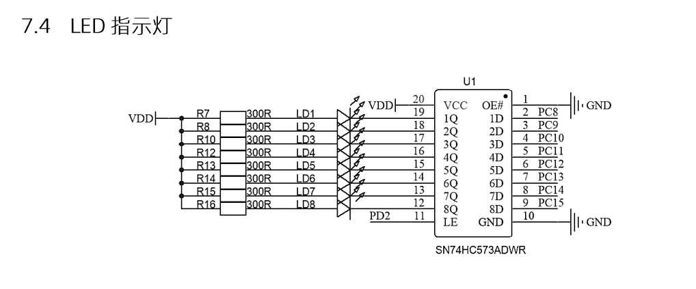

# LED驱动



这里可以看出我们不能直接对LED引出的引脚直接操作，这样会影响服用的IO，需要借助`74HC573`锁存器。

当`74HC573`锁存器的LE引脚为低电平的时候，操作IO口是无法改变IO的输出值，当为高电平时，左边Q输入的值才会输出到D。

## 驱动思路

下面是代码示例：

```c title="led.h"
#ifndef __LED_H
#define __LED_H

#include "app.h"

/**
 * LED id
 */
typedef enum {
    LD1 = 0,
    LD2,
    LD3,
    LD4,
    LD5,
    LD6,
    LD7,
    LD8
} Led_Id;

void LedInit(void);
void LedWirte(Led_Id id, GPIO_PinState pin_state);

#endif //__LED_H
```

```c title="led.c"
#define LD_GPIO     GPIOC

#define LED_SET     (uint16_t)0xff00

static uint16_t led_status = 0xff00;

void LedInit(void){
    LD_GPIO->ODR = LED_SET;
    HAL_GPIO_WritePin(GPIOD, GPIO_PIN_2, GPIO_PIN_SET);
    HAL_GPIO_WritePin(GPIOD, GPIO_PIN_2, GPIO_PIN_RESET);
}

/**
 * 控制LED引脚电平
 * @param id LED id
 * @param pin_state 电平状态
 */
static void LedWrite_Drv(Led_Id id, GPIO_PinState pin_state) {
    if (pin_state) {  // 1
        led_status |= (pin_state & 0x01) << (id + 8);
        debug("led_status:0x%x", led_status);
    } else {
        led_status &= ~((pin_state | 0x01) << (id + 8));
        debug("led_status:0x%x", led_status);
    }
    LD_GPIO->ODR = led_status;
    HAL_GPIO_WritePin(GPIOD, GPIO_PIN_2, GPIO_PIN_SET);
    HAL_GPIO_WritePin(GPIOD, GPIO_PIN_2, GPIO_PIN_RESET);
}

void LedWirte(Led_Id id, GPIO_PinState pin_state){
	if (pin_state) {  // 1
        led_status |= (pin_state & 0x01) << (id + 8);
        debug("led_status:0x%x", led_status);
    } else {
        led_status &= ~((pin_state | 0x01) << (id + 8));
        debug("led_status:0x%x", led_status);
    }
    LD_GPIO->ODR = led_status;
    HAL_GPIO_WritePin(GPIOD, GPIO_PIN_2, GPIO_PIN_SET);
    HAL_GPIO_WritePin(GPIOD, GPIO_PIN_2, GPIO_PIN_RESET);
}
```
