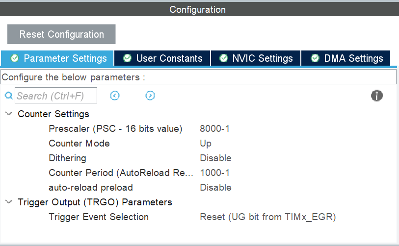
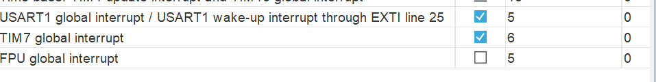
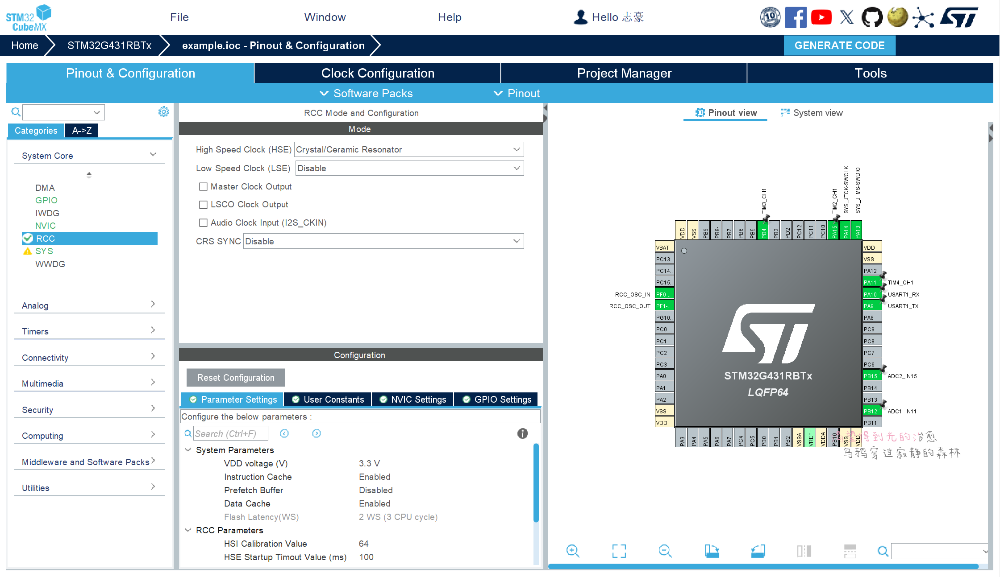
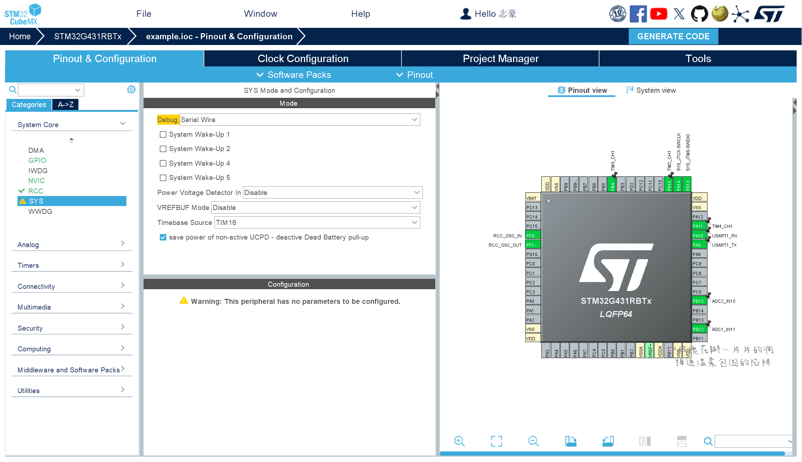
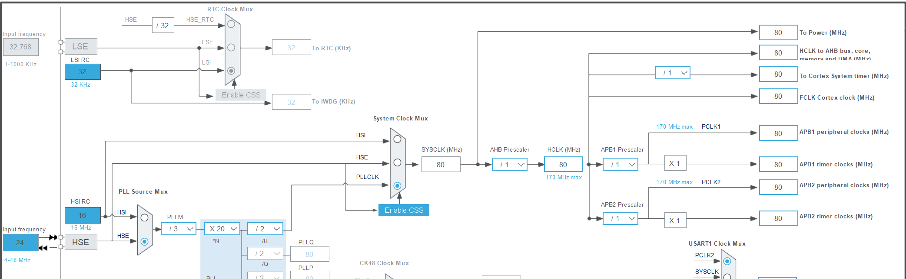

# 快速入门

蓝桥杯嵌入式赛道开发板板载资源：

| 资源     | 配备 | 资源     | 配备 |
|--------|----|--------|----|
| LCD    | 1  | 可编程电阻  | 1  |
| 按键     | 4  | 信号发生器  | 2  |
| LED    | 8  | 可调分压电位器  | 2  |
| E2PROM     | 1  |  |   |

:::tip[基本约定]

- 使用`TIM7`作为硬件定时器，中断间隔为`10ms`
- 使用`TIM16`作为Hal库的时基定时器
- `stm32CubeMX`版本 $\ge$ 6.11.0

:::

## 基础配置

### 日志配置

由于比赛的限制，本项目的日志设计的非常简单，只包含`debug`和`error`标签，并且，使用printf进行二次封装。

```c
/* if define DEBUG,open debug and error */
#ifdef DEBUG
#define debug(format, ...) \
        printf("[debug] "format"\n", ##__VA_ARGS__)
#define error(format, ...) \
        printf("[error] "format"\n", ##__VA_ARGS__)
#else
#define debug(format, ...)
#define error(format, ...)
#endif
```

### 硬件定时器

在比赛中，是可以使用软件定时器，但是，无法满足某些应用场景，比如：

- 调用的软件定时器RTOS接口，无法在中断中开关软件定时器
- 软件定时器是无法在线程阻塞时，中断线程的

所以，需要实现一个简单的硬件定时。

由于比赛时间的限制，无法真正的写一个硬件定时器，选择对硬件定时器进行代码层面规范。

#### 硬件定时器初始化配置





以下是硬件定时器的模板回调函数：

```c
static uint8_t <name>count = 0;
// 回调应用函数
void <name>Callback(void) {
    <name>count++;
    if (<name>count >= <count time>) {
        <name>count = 0;
        // 应用代码
    }
}
```

### 基础初始化配置

#### cubx配置

配置调试接口：



配置RCC时钟:





配置FreeRTOS：

<div>


</div>

#### 代码配置

初始化拆分为外设初始化和应用程序初始化

外设初始化，在调度器开始之前，用于初始化LED、LCD...
应用程序初始化，在调度器开始之后,用于

```c title="app.c"
#include "app.h"
#include "FreeRTOS.h"

// 引荐初始化
void Hardware_Init(void){
}

int app(void){
    debug("sum free:%d",xPortGetFreeHeapSize());

    if(xPortGetFreeHeapSize() == 0){
         goto ERROR;
    }

    return 0;
    ERROR:
    return -1;
}

#ifdef  __CC_ARM
int fputc(int ch, FILE *stream) {
    while ((USART1->ISR & 0X40) == 0);     //等待上一次串口数据发送完成
    USART1->TDR = (uint8_t) pBuffer[i];    //写DR,串口1将发送数据
    return ch;
}
#elifdef __GNUC__

int _write(int fd, char *pBuffer, int size) {
    for (int i = 0; i < size; i++) {
        while ((USART1->ISR & 0X40) == 0);  //等待上一次串口数据发送完成
        USART1->TDR = (uint8_t) pBuffer[i]; //写DR,串口1将发送数据
    }
    return size;
}

#endif
```

```c title="app.h"
#ifndef __APP_H
#define __APP_H

#include "main.h"
#include "cmsis_os2.h"
#include <stdio.h>

/* 调试文件 */
#ifdef DEBUG
#define debug(format, ...) \
        printf("[debug] "format"\n", ##__VA_ARGS__)
#define error(format, ...) \
        printf("[error] "format"\n", ##__VA_ARGS__)
#else
#define debug(format, ...)
#define error(format, ...)
#endif
```

定义app的接口需要将`app()`和`hardware_init()`引用在`main.c`中，以下是代码：

```c title="main.c"
/**
  * @brief  The application entry point.
  * @retval int
  */
int main(void)
{
  //...
  MX_GPIO_Init();
  MX_TIM7_Init();
  MX_USART1_UART_Init();
  /* USER CODE BEGIN 2 */
  // highlight-next-line
  Hardware_Init();
  /* USER CODE END 2 */

  /* Init scheduler */
  osKernelInitialize();
  //...
}

void StartDefaultTask(void *argument)
{
  /* USER CODE BEGIN 5 */
  /* Infinite loop */
  // highlight-start
    if (app() != 0) {
        Error_Handler();
    }
    osThreadExit();
  // highlight-end
  /* USER CODE END 5 */
}
```

:::warning
请务必在`main.c`文件开头声明`app()`和`hardware_init()`
:::

## 外设

### 串口

对于串口外设来说，发送比较简单，是需要重定向`printf()`即可，但是，对于接收有一点过的难度，所以，只对接收进行模块化。

这里将串口接收抽象出来，使其只需要关注对于`buf`进行应用，以下是代码：

```c
#include "app.h"
#include <stdio.h>
#include <string.h>

static uint8_t rx_buf[20];
static uint32_t count = 0;

void UsartTask(void *arg) {
    HAL_UART_Receive_IT(&huart1, rx_buf, 1);
    // 清除tim
    __HAL_TIM_SET_COUNTER(&htim7, 0);
    // 清除tim更新中断标志
    __HAL_TIM_CLEAR_IT(&htim7, TIM_IT_UPDATE);
    // 缓存区清零
    memset(rx_buf, 0, sizeof(rx_buf));
    while (1) {
        osSemaphoreAcquire(uartBinarySemHandle, osWaitForever);
        HAL_UART_Abort_IT(&huart1);
        /* 接收buf 应用代码 开始 */
        
        /* 接收buf 应用代码 结束 */
        HAL_UART_Receive_IT(&huart1, rx_buf, 1);
        memset(rx_buf, 0, sizeof(rx_buf));
        count = 0;
    }
}

void HAL_UART_RxCpltCallback(UART_HandleTypeDef *huart) {
    if (huart->Instance == USART1) {
        __HAL_TIM_SET_COUNTER(&htim7, 0);
        HAL_TIM_Base_Start_IT(&htim7);
  // 计数
        count++;
        HAL_UART_Receive_IT(huart, rx_buf + count, 1);
    }
}

uint8_t uart_count = 0;

void UartCallback(void) {
    uart_count++;
    if (uart_count >= 1) {
        uart_count = 0;
        HAL_TIM_Base_Stop_IT(&htim7);
        __HAL_TIM_CLEAR_IT(&htim7, TIM_IT_UPDATE);
        __HAL_TIM_SET_COUNTER(&htim7, 0);
        osSemaphoreRelease(uartBinarySemHandle);
    }
}
```

### LCD

为了方便LCD的数据写入，需要对`LCD`显示字符串进行改写，使其增加`x`方向显示，使字符显示更加精确。

```c title="app_lcd.c"
void LCD_StringLine(uint8_t Line, uint8_t x,uint8_t *ptr)
{
    uint32_t i = 0;
    uint16_t refcolumn = (319 - (x * 16)); //319

    while ((*ptr != 0) && (i < 20)) // 20
    {
        LCD_DisplayChar(Line, refcolumn, *ptr);
        refcolumn -= 16;
        ptr++;
        i++;
    }
}
```

### 按键

根据以往的比赛经验，对于按键来说，只需要实现单击、双击、长按。

这里使用通过：

- 扫描按键线程
- 使用软件定时器判断按下次数
- 使用硬件定时器判断长按

```c title="key.c"
#include "app.h"
#include <stdio.h>

static uint8_t Key1Value = 0;
static uint8_t Key2Value = 0;

void KeyTask(void *arg) {
    while (1) {
        if (HAL_GPIO_ReadPin(KEY1_GPIO_Port, KEY1_Pin) == 0) {
            if (Key1Value == 0) {
                osTimerStart(key1TimerHandle, 150);
            }
            while (HAL_GPIO_ReadPin(KEY1_GPIO_Port, KEY1_Pin) == 0);
            Key1Value++;
        }

        if (HAL_GPIO_ReadPin(KEY2_GPIO_Port, KEY2_Pin) == 0) {
            if (Key2Value == 0) {
                osTimerStart(key2TimerHandle, 150);
            }
            while (HAL_GPIO_ReadPin(KEY2_GPIO_Port, KEY2_Pin) == 0);
            Key2Value++;
        }
        osDelay(50);
    }
}

void Key1Callback(void *arg) {
    lcdData_t *lcd_data;
    debug("key1 value:%d\n",Key1Value);
    if (Key1Value == 1) {
        LcdPsd_Data(lcdData_key);
        lcd_data = (lcdData_t *) osMemoryPoolAlloc(lcdMemoryPoolHandle, 0);
        lcd_data->flag = 3;
        osMessageQueuePut(lcdQueueHandle, &lcd_data, 0, 0);
    } else if (Key1Value == 2) {

    } else {}

    Key1Value = 0;
}

static uint8_t led_data = 0;
void Key2Callback(void *arg) {
    debug("key2 value:%d\n",Key2Value);
    if (Key2Value == 1) {
        
    } else if (Key2Value == 2) {
        
    } else {}

    Key2Value = 0;
}
```

### LED

对于蓝桥杯嵌入式的板子，并没有直接使用IO口连接LED，而是通过一个`74HC573`控制LED，实现了对IO的复用和LED的状态锁存。

74HC573 真值表：
<table>
    <tr>
        <th colspan="3">输入</th>
        <th>输出</th>
    </tr>
    <tr>
        <td>Output Enable</td>
        <td>Latch Enable</td>
        <td>D</td>
        <td>Q</td>
    </tr>
   <tr>
        <td>L</td>
        <td>H</td>
        <td>H</td>
        <td>H</td>
    </tr>
    <tr>
        <td>L</td>
        <td>H</td>
        <td>L</td>
        <td>L</td>
    </tr>
    <tr>
        <td>L</td>
        <td>L</td>
        <td>X</td>
        <td>no change</td>
    </tr>
    <tr>
        <td>H</td>
        <td>X</td>
        <td>X</td>
        <td>Z</td>
    </tr>
</table>

根据真值表，得到一个事实，只有当LD为低电平时，才能改变LED状态。而且8个LED是依次排布的`7~15`，所以，当配置好了LED后，只需要操作`ODR`寄存器和改变LD引脚状态，就可以改变LED状态。

驱动代码如下：

```c
#define LD_GPIO     GPIOC

static uint16_t led_status = 0xff00;

/**
 * LED id
 */
typedef enum {
    LD1 = 0,
    LD2,
    LD3,
    LD4,
    LD5,
    LD6,
    LD7,
    LD8
} Led_Id;

/**
 * 控制LED引脚电平
 * @param id LED id
 * @param pin_state 电平状态
 */
void LedWrite(Led_Id id, GPIO_PinState pin_state) {
    HAL_GPIO_WritePin(GPIOD, GPIO_PIN_2, GPIO_PIN_SET);
    if (pin_state) {  // 1
        led_status |= (pin_state & 0x01) << (id + 8);
        debug("led_status:0x%x", led_status);
    } else {
        led_status &= ~((pin_state | 0x01) << (id + 8));
        debug("led_status:0x%x", led_status);
    }
    LD_GPIO->ODR = led_status;
    HAL_GPIO_WritePin(GPIOD, GPIO_PIN_2, GPIO_PIN_RESET);
}
```

### E2PROM和可编程电阻(IIC)

由于蓝桥杯得板子没法使用硬件IIC，所以，只能使用软件IIC。

:::warning
对于软件IIC，在GNUC平台上无法使用，具体是什么原因还在调试中，但是在MDK平台中是可以正常使用的！
:::

```c
// 确保读写API一致

#define    AT24C02_ADDR_WRITE  0xA0
#define    AT24C02_ADDR_READ   0xA1

/**
 * @brief        AT24C02任意地址写一个字节数据
 * @param        addr —— 写数据的地址（0-255）
 * @param        dat  —— 存放写入数据的地址
 * @retval        成功 —— HAL_OK
*/
void At24c02_Write_Byte(uint16_t addr, uint8_t* data)
{
    I2CStart();
 I2CSendByte(AT24C02_ADDR_WRITE);
 I2CWaitAck();
 I2CSendByte(addr);
 I2CWaitAck();
 I2CSendByte(data);
 I2CWaitAck();
 I2CStop();
    HAL_Delay(5);
}

/**
 * @brief        AT24C02任意地址读一个字节数据
 * @param        addr —— 读数据的地址（0-255）
 * @param        read_buf —— 存放读取数据的地址
 * @retval        成功 —— HAL_OK
*/
uint8_t At24c02_Read_Byte(uint16_t addr, uint8_t* read_buf)
{
 I2CStart();
 I2CSendByte(0xa0);
 I2CWaitAck();
 I2CSendByte(addr);
 I2CWaitAck();
 
 I2CStart();
 I2CSendByte(0xa1);
 I2CWaitAck();
 *read_buf = I2CReceiveByte();
 I2CWaitAck();
 I2CStop();
}
```

## 编程方式

### 异步编程

> [!note]
>
> 备注
